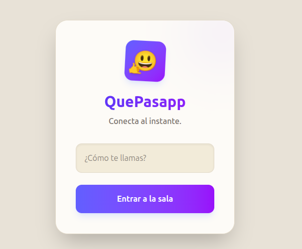
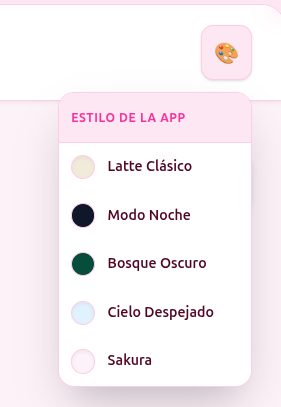
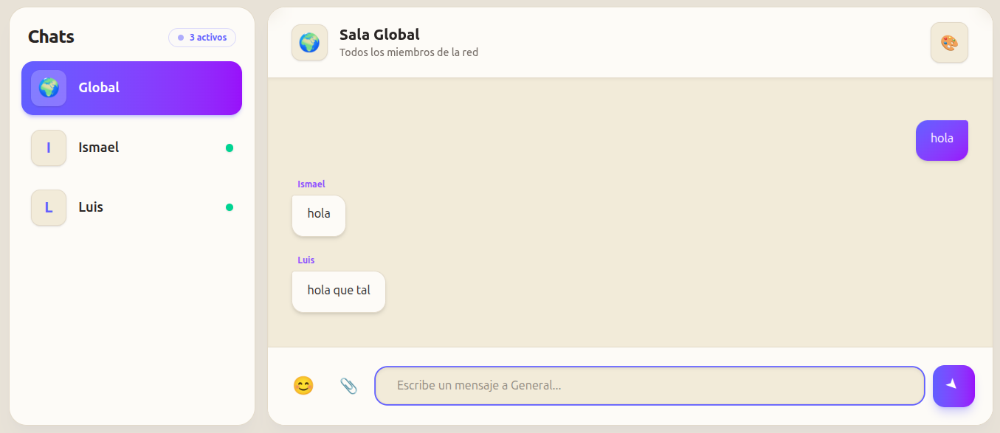
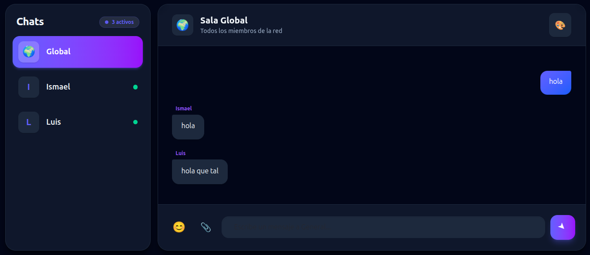
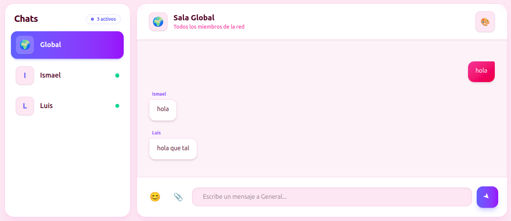

# 🤙 QuePasapp - Real-Time Chat Experience

Bienvenido a **QuePasapp**, una aplicación de mensajería instantánea *full-stack* con un diseño moderno, acogedor y totalmente personalizable.


---

## ✨ Características Principales

*   **⚡ Mensajería en Tiempo Real:** Comunicación instantánea mediante WebSockets y protocolo STOMP.
*   **🔒 Chats Privados:** Conversaciones 1 a 1 con sistema de notificaciones de mensajes sin leer.
*   **🎨 Personalización "Full-App":** 5 temas integrales (Latte, Noche, Bosque, Cielo, Sakura) que cambian el fondo, las burbujas y toda la interfaz.
*   **📁 Soporte Multimedia:** Envío de imágenes, vídeos y documentos con previsualización.
*   **😊 Selector de Emojis:** Integración de `emoji-picker-react` con soporte para modo oscuro.
*   **✅ Ticks de Estado:** Seguimiento visual (Pendiente 🕒, Enviado ✓, Recibido ✓✓, Leído ✓✓ azul).

---

## 📸 Capturas del Proyecto

### **Acceso y Personalización**
| Pantalla de Inicio | Menú de Temas |
| :---: | :---: |
|  |  |
| *Acceso con logo dinámico 🤙😃* | *Selector de ambientes* |

### **Experiencia de Chat**
| Chat Grupal (Global) | Chat Privado (Modo Noche) | Chat Sakura (Multimedia) |
| :---: | :---: | :---: |
|  |  |  |
| *Sala común para todos* | *Interfaz oscura de alto contraste* | *Burbujas dinámicas y archivos* |

---

## 🛠️ Instalación y Configuración

Sigue estos pasos para reproducir la aplicación exactamente igual en otro dispositivo:

### 1. Requisitos Previos
*   **Java JDK 17** o superior.
*   **Node.js** (v18+) y **npm**.
*   **IntelliJ IDEA** (recomendado para el Backend).
*   **VS Code** (recomendado para el Frontend).

### 2. Configuración del Backend (Spring Boot)
1.  Clona el repositorio.
2.  Importa el proyecto en IntelliJ como **Maven Project**.
3.  Configura el archivo `src/main/resources/application.properties` para permitir archivos grandes:
    ```properties
    spring.servlet.multipart.max-file-size=50MB
    spring.servlet.multipart.max-request-size=50MB
    ```
4.  Ejecuta la clase `ChatBackEndApplication`. El servidor backend estará activo en `http://localhost:8080`.

### 3. Configuración del Frontend (React)
1.  Abre una terminal en la carpeta raíz del frontend.
2.  **Instalación de dependencias (CRUCIAL):** Ejecuta el siguiente comando para instalar todas las librerías necesarias del proyecto:
    ```bash
    npm install
    ```
    *Nota: Si el proyecto es nuevo o faltan librerías, asegúrate de tener instaladas:*
    `npm install @stomp/stompjs sockjs-client emoji-picker-react`
3.  Lanza la aplicación en modo desarrollo:
    ```bash
    npm run dev
    ```
4.  Accede a `http://localhost:5173`.

---

Desarrollado con ❤️ por Melissa.